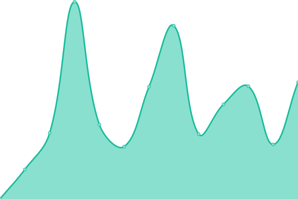
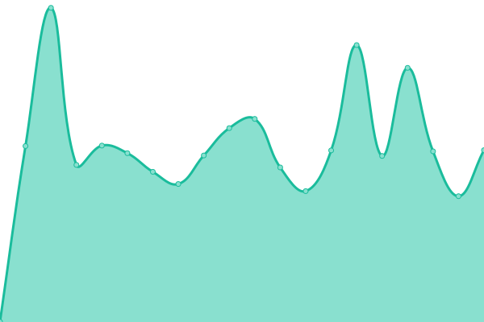

# [📈 Live Status](https://ThomasGerr.github.io/ethicbyte_upptime): <!--live status--> **🟩 All systems operational**

This repository contains the open-source uptime monitor and status page for [ThomasGerr](https://ThomasGerr.github.io/ethicbyte_upptime), powered by [Upptime](https://github.com/upptime/upptime).

With [Upptime](https://upptime.js.org), you can get your own unlimited and free uptime monitor and status page, powered entirely by a GitHub repository. We use [Issues](https://github.com/ThomasGerr/ethicbyte_upptime/issues) as incident reports, [Actions](https://github.com/ThomasGerr/ethicbyte_upptime/actions) as uptime monitors, and [Pages](https://ThomasGerr.github.io/ethicbyte_upptime) for the status page.

<!--start: status pages-->
<!-- This summary is generated by Upptime (https://github.com/upptime/upptime) -->
<!-- Do not edit this manually, your changes will be overwritten -->
<!-- prettier-ignore -->
| URL | Status | History | Response Time | Uptime |
| --- | ------ | ------- | ------------- | ------ |
|  [Ethicbyte website](https://www.ethicbyte.nl) | 🟩 Up | [ethicbyte-website.yml](https://github.com/ThomasGerr/ethicbyte_upptime/commits/HEAD/history/ethicbyte-website.yml) | 

 702ms
     
 | 

<a href="https://ThomasGerr.github.io/ethicbyte_upptime/history/ethicbyte-website">98.59%</a>
    

|  [Persoonlijke website Thomas Gerrits](https://www.thomasgerrits.nl) | 🟩 Up | [persoonlijke-website-thomas-gerrits.yml](https://github.com/ThomasGerr/ethicbyte_upptime/commits/HEAD/history/persoonlijke-website-thomas-gerrits.yml) | 

 450ms
     
 | 

<a href="https://ThomasGerr.github.io/ethicbyte_upptime/history/persoonlijke-website-thomas-gerrits">99.16%</a>
    

|  [Nowayste escapes](https://www.nowayste-escapes.nl) | 🟩 Up | [nowayste-escapes.yml](https://github.com/ThomasGerr/ethicbyte_upptime/commits/HEAD/history/nowayste-escapes.yml) | 

 2740ms
     
 | 

<a href="https://ThomasGerr.github.io/ethicbyte_upptime/history/nowayste-escapes">94.73%</a>
    

|  [Braat wiki](https://braatwiki.ethicbyte.nl) | 🟩 Up | [braat-wiki.yml](https://github.com/ThomasGerr/ethicbyte_upptime/commits/HEAD/history/braat-wiki.yml) | 

 733ms
     
 | 

<a href="https://ThomasGerr.github.io/ethicbyte_upptime/history/braat-wiki">95.95%</a>
    

|  [youtube.com](https://www.youtube.com) | 🟩 Up | [youtube-com.yml](https://github.com/ThomasGerr/ethicbyte_upptime/commits/HEAD/history/youtube-com.yml) | 

 284ms
     
 | 

<a href="https://ThomasGerr.github.io/ethicbyte_upptime/history/youtube-com">100.00%</a>
    

<!--end: status pages-->

[**Visit our status website →**](https://ThomasGerr.github.io/ethicbyte_upptime)

## 📄 License

- Powered by: [Upptime](https://github.com/upptime/upptime)
- Code: [MIT](./LICENSE) © [Anand Chowdhary](https://anandchowdhary.com), supported by [Pabio](https://pabio.com)
- Data in the `./history` directory: [Open Database License](https://opendatacommons.org/licenses/odbl/1-0/)
